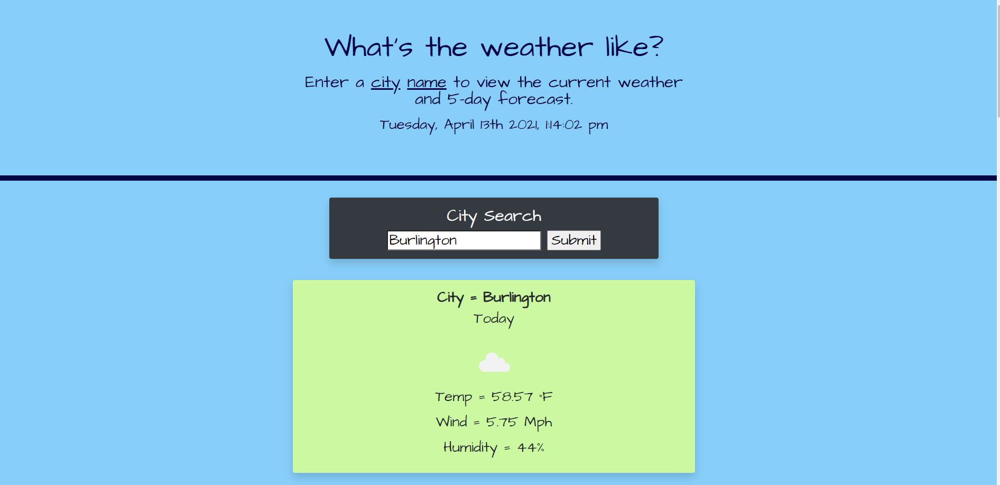
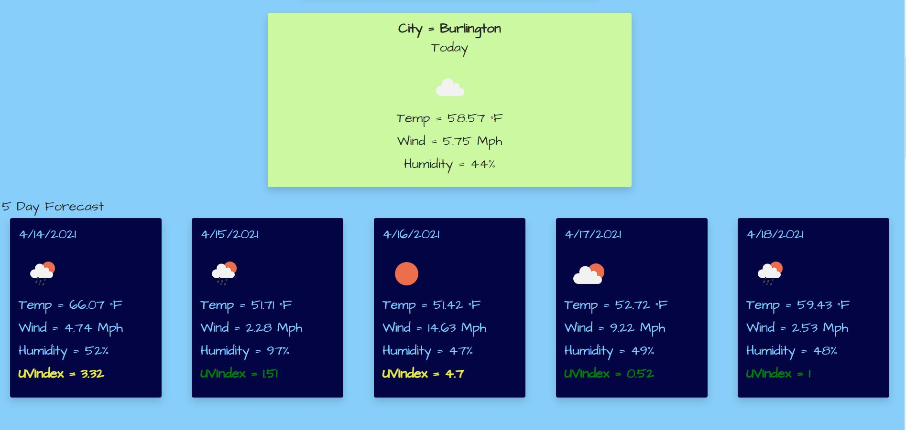

# 06 Server-Side APIs: Weather Dashboard


## Description

I created a simple weather dashboard using a third-party API that enabled access to weather data by making requests with specific parameters to a URL. The weather dashboard runs in the browser and features dynamically updated HTML and CSS.

[OpenWeather One Call API](https://openweathermap.org/api/one-call-api) was the API used to retrieve weather data for cities. 


## User Story

```
AS A traveler
I WANT to see the weather outlook for multiple cities
SO THAT I can plan a trip accordingly
```

## Key Features

```
* Upon page loading, the user is presented with a default page that shows the weather for Boston
* The current day and time displays dynamically without refreshing the page
* The user enters a city name and recieves the weather for the current day and 5-day forecast for that city
* An icon illustrates the weather conditions that describe each day
* The user is able to view the UV index according to color that indicates whether the conditions are favorable, moderate, or severe
* The user can view thier search history (not yet enabled)

```
## Tools Used

```
* HTML
* CSS
* JQuery
* Bootstrap
* Moment.js
* JavaScript
* API
* Google Fonts

```

## Screen Capture

The following shows the visual display and functionality of the weather dashboard:



Screen Capture Continued...




## Deployed application

The URL of the deployed application.
https://ndaruwalla.github.io/weather/

## GitHub repository

The URL of the GitHub repository that contains my code.
https://github.com/NDaruwalla/weather/


---
